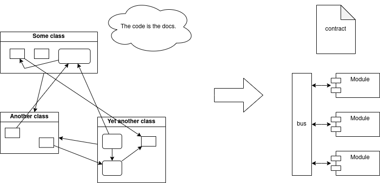

# Boost.Independency

This library provides a ready to use implementation for the
message bus pattern, you may also know it as Publish-Subscribe.
Frequently, this approach utilized in large projects with lots
servers and clients, but it also quite useful inside the single
binary. This approach turns your code from the huge mess of
chaotic dependencies to the well-structured code that easy to
maintain and append.

